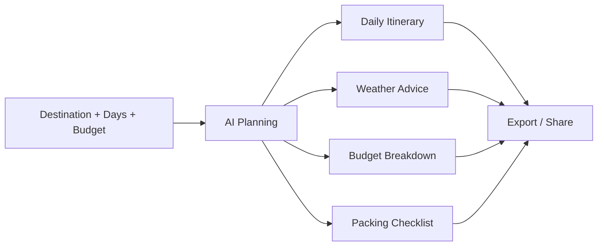

<div align="center">

# VoyageAI

**Plan a complete trip from destination, days and budget with AI.**

[English](./README.md) | [简体中文](./README.zh-CN.md)

[](https://voyageai.seanwalter.top/)
[](https://vuejs.org)
[](https://fastapi.tiangolo.com)
[](./LICENSE)

</div>

---

## What it does

VoyageAI turns a few trip constraints into a usable plan:

- daily itinerary generation
- destination weather and travel advice
- budget breakdown and visualization
- packing checklist
- Markdown / JSON export
- responsive desktop and mobile UI

---

## Demo

<div align="center">


</div>

**Live:** https://voyageai.seanwalter.top/

---

## Quick Start

### Backend

```bash
git clone https://github.com/Dream22180971/VoyageAI.git
cd VoyageAI/backend

pip install -r requirements.txt
# configure .env with the required model / map keys
python main.py
```

Backend: `http://localhost:8000`

### Frontend

Open another terminal:

```bash
cd VoyageAI/frontend

npm install
npm run dev
```

Frontend: `http://localhost:5173`

---

## Product Flow



---

## Core Features

| Feature | Description |
|---|---|
| AI itinerary | generates a day-by-day plan from trip constraints |
| Weather integration | shows destination weather and practical advice |
| Budget analysis | splits transportation, hotel, food and activity costs |
| Travel checklist | generates a pre-trip packing list |
| Export | Markdown / JSON output |
| Themes | light and dark modes |
| Responsive UI | mobile-friendly layout |

---

## Architecture

```text
Frontend
Vue 3 · Vite · Vue Router · ECharts
        │
        ▼
Backend
FastAPI · HTTPX · OpenAI-compatible client
        │
        ├── AI itinerary generation
        ├── weather / map integration
        └── persistence
```

---

## Current Limitations

- itinerary quality depends on model output and prompt quality
- external weather / map capabilities depend on configured APIs
- generated travel plans should still be checked before booking
- real-time prices are not guaranteed unless a live pricing source is connected

---

## Roadmap

- [x] itinerary generation
- [x] weather integration
- [x] budget visualization
- [x] packing checklist
- [x] export
- [ ] richer multi-city planning
- [ ] live hotel / transport pricing integrations
- [ ] collaborative itinerary editing
- [ ] shareable public trip pages

---

## License

[MIT](./LICENSE)

<div align="center">

**Spend less time assembling travel notes. Spend more time deciding where to go.**

</div>
