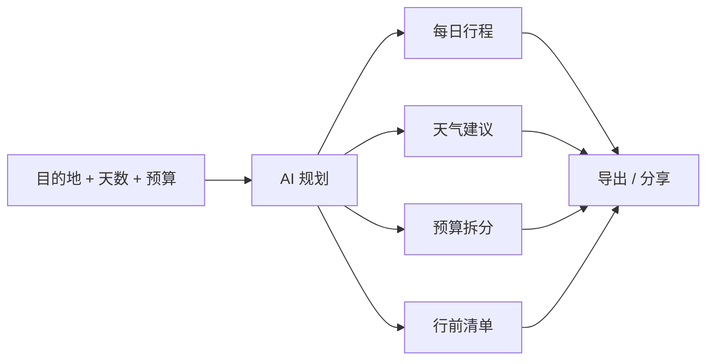

<div align="center">

# VoyageAI

**输入目的地、天数和预算，让 AI 生成一份可以直接使用的旅行计划。**

[English](./README.md) | [简体中文](./README.zh-CN.md)

[](https://voyageai.seanwalter.top/)
[](https://vuejs.org)
[](https://fastapi.tiangolo.com)
[](./LICENSE)

</div>

---

## 它能做什么

VoyageAI 把旅行前最耗时间的几件事合到一个流程里：

- 生成每日行程
- 查看目的地天气和出行建议
- 拆分并可视化预算
- 生成行前清单
- 导出 Markdown / JSON
- 支持桌面端与移动端

---

## 演示

<div align="center">


</div>

**在线体验：** https://voyageai.seanwalter.top/

---

## 5 分钟快速开始

### 后端

```bash
git clone https://github.com/Dream22180971/VoyageAI.git
cd VoyageAI/backend

pip install -r requirements.txt
# 在 .env 中配置模型 / 地图等所需 Key
python main.py
```

后端：`http://localhost:8000`

### 前端

另开一个终端：

```bash
cd VoyageAI/frontend

npm install
npm run dev
```

前端：`http://localhost:5173`

---

## 产品流程



---

## 核心功能

| 功能 | 说明 |
|---|---|
| AI 行程 | 根据旅行约束生成逐日计划 |
| 天气接入 | 提供目的地天气与实用建议 |
| 预算分析 | 拆分交通、住宿、餐饮和活动费用 |
| 行前清单 | 自动生成打包 / 准备清单 |
| 导出 | Markdown / JSON |
| 主题 | 浅色 / 深色 |
| 响应式 | 适配移动端 |

---

## 技术架构

```text
Frontend
Vue 3 · Vite · Vue Router · ECharts
        │
        ▼
Backend
FastAPI · HTTPX · OpenAI-compatible client
        │
        ├── AI 行程生成
        ├── 天气 / 地图能力
        └── 数据持久化
```

---

## 当前限制

- 行程质量受模型和 Prompt 影响
- 天气 / 地图能力依赖外部 API
- AI 生成计划在实际预订前仍需人工核对
- 未接实时价格源时，价格不代表最终成交价

---

## 路线图

- [x] 行程生成
- [x] 天气能力
- [x] 预算可视化
- [x] 行前清单
- [x] 导出
- [ ] 多城市行程
- [ ] 酒店 / 交通实时价格
- [ ] 协作编辑
- [ ] 可分享公开行程页

---

## License

[MIT](./LICENSE)

<div align="center">

**少一点整理攻略的时间，多一点真正决定去哪儿的时间。**

</div>
